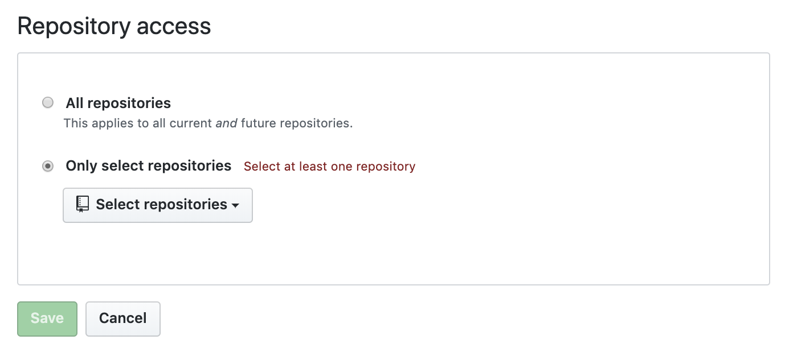

# Pristine Bot 

A Pull request bot.

- Install Pristine-bot
- Setup a repo that emits changes when updated.
- Set a list of repos to listen for those changes.

## Installation

```javascript
npm install pristine-bot
```

## Dependencies

- [git](https://git-scm.com/downloads) is required.

## Configure Pristine-bot:

```javascript
import PristineBot from "pristine-bot"

const config = { 
  owner: "etccorelabs",
  workingDir: __dirname,
  templateConfigs: [
    {
      template: "pristine",
      listeningRepos: [
        "testing_repo_1", 
        "testing_repo_2"
      ]
    }, 
    {
      template: "pristine-typescript",
      listeningRepos: [ 
        "testing_repo_3" 
      ]
    }
  ]
}

async function startBot() {
  const bots = await PristineBot(config)

  bots.map((bot) => {    
    bot.on("error", async (error) => {
      console.log("-- REPO_PR_ERROR --", error)
    })
  
    bot.on("submitted", async (repo) => {
      console.log("-- REPO_PR_SUBMITTED --", repo)
    })
  
    bot.on("completed", async (repos) => {
      console.log("-- ALL_REPO_PRS_SUBMITTED --", repos)
    })
  })
}

startBot()
```

## Configuration options:

| Option  | Description |
| ------- | :---------: |
| owner   | The name of the account owner or org. (*required*) |
| workingDir | A root dir to clone repos to. example: "/ROOT/tmp/repos". (*required*) |
| templateConfigs[] | An array of template configs. (*required*) |

#### Template Config

| Option  | Description |
| ------- | :---------: |
| template | The name of the template repo (*required*) |
| listeningRepos | Repos subscribed to template changes (*required*) |
| defaultRemote | Remote name to set for remote template url. (*optional*) |
| defaultBranchName | Name of the branch where changes will be implemented: *feat/pristine-changes*. (*optional*) |
| defaultPRTitle | The title of the Pull Request, default: *Pristine changes*. (*optional*) |
| defaultConflictCommitMessage | The commit message for merge conflicts, default: *fix: Pristine changes with conflicts*. (*optional*) |
| defaultPRBody | The contents of the Pull Request, default: N/A. (*optional*) |

## Pristine-bot is powered by [Probot](https://probot.github.io):

To run your app in development, you will need to configure a GitHub App to deliver webhooks to your local machine.

1. On your local machine, copy .env.example to .env.

Example:

```bash
APP_ID=0111
PRIVATE_KEY="PRIVATE"
WEBHOOK_SECRET="SECRET"
WEBHOOK_PROXY_URL=https://smee.io/SMEE_ID
```

2. Go to smee.io and click Start a new channel. Set WEBHOOK_PROXY_URL in .env to the URL that you are redirected to.

3. Create a new GitHub App with:

- Webhook URL: Use your WEBHOOK_PROXY_URL from the previous step.

- Webhook Secret: development (Note: For optimal security, Probot apps require this secret be set, even though it's optional on GitHub.).

- Permissions & events is located lower down the page and will depend on what data you want your app to have access to. Note: if, for example, you only enable issue events, you will not be able to listen on pull request webhooks with your app. However, for development we recommend enabling everything.

4. Download the private key and move it to your project's directory. As long as it's in the root of your project, Probot will find it automatically regardless of the filename.

5. Edit .env and set APP_ID to the ID of the app you just created. The App ID can be found in your app settings page here 

Probot [docs.](https://probot.github.io/docs/development/)

## Give PristineBot access to all repos listed in config:

- Go to org or repo settings and click installed github apps.



## Deployment:
- Pristine-bot for production: [link](https://probot.github.io/docs/deployment/)

### Contributing

How to contribute, build and release are outlined in [CONTRIBUTING.md](CONTRIBUTING.md), [BUILDING.md](BUILDING.md) and [RELEASING.md](RELEASING.md) respectively. Commits in this repository follow the [CONVENTIONAL_COMMITS.md](CONVENTIONAL_COMMITS.md) specification.

